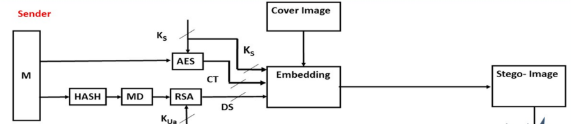
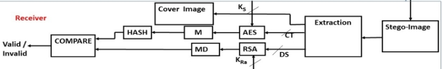
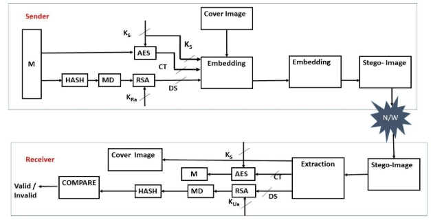

**THE DESIGN APPROACH AND IMPLEMENTATION** 

**Proposed System:** 

A hybrid cryptographic algorithm is designed using a symmetric key algorithm and a asymmetric key algorithm, Moreover LSB steganography technique is applied for additional security. 

Here the symmetric key algorithm used is Advanced Encryption Standard (AES) and the asymmetric key algorithm used is RSA (Rivest-Shamir-Adleman). 

**Encryption (Sender side):** 

In the sender side using symmetric key, encryption of the text message is performed using AES algorithm to obtain the cipher text, CT. From the text message a hash value is generated using SHA-256 to get Digest, DG. Using RSA algorithm’s public key, encryption of digest is performed to obtain the digital signature, DS. Using RSA algorithm’s public key, the AES symmetric key which was generated during the encryption of the text message is encrypted. All the encrypted data i.e. the cipher text obtained after encryption of the text message, the digital signature and the key are combined together to form a Embed Message, EM. This Embed message, EM is hidden in the cover image using LSB steganography technique and the output image obtained is known as “conceal image”. 

**Decryption (Receiver side):** 

In the receiver side, the conceal image is received from the sender. After obtaining the conceal image, the Full message is extracted using LSB steganography technique. Using RSA algorithm’s  private key the receiver with decrypt the AES symmetric key and this symmetric key is used to decrypt the cipher text, CT to get the actual text message. Using RSA algorithm’s  private key the digital signature DG is decrypted to get the message digest, MD. Using SHA-256 algorithm a hash value is generated by passing the actual message. If the message digest matches the hash value, then the message integrity is not violated,  Otherwise the message integrity is breached. 

**Integration:** 

After designing the encryption and decryption phases separately, both the phases are integrated 

 
